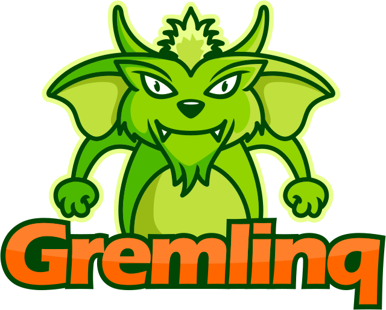

  

ExRam.Gremlinq is a .NET object-graph-mapper for Apache TinkerPop Gremlin enabled databases. I began development on ExRam.Gremlinq in 2017 after my boss at ExRam Innovations and I decided that our new project would be backed by a graph database. Until then, we had been using traditional relational databases and were used to the comfort of ORMs (object-relational-mappers) for development on the .NET platform. However, I found out that there was no such tool for accessing graph databases from .NET through the Gremlin query language. So I set out to fill that gap.

In 2021, I was allowed to publish [an article about ExRam.Gremlinq in the german dotnetpro magazine.](https://www.dotnetpro.de/tools/datenzugriff/gremlin-plus-linq-gremlinq-2621192.html) 

ExRam.Gremlinq's main repo lives [here](https://github.com/ExRam/ExRam.Gremlinq), whereas there is also a [samples repo](https://github.com/ExRam/ExRam.Gremlinq.Samples) that serves as a starting point for new projects based on ExRam.Gremlinq, as well as a place to show off its features.

If you're interested in commercial support/training/consulting for ExRam.Gremlinq, contact me at [support@danielcweber.net](mailto:support@danielcweber.net).

